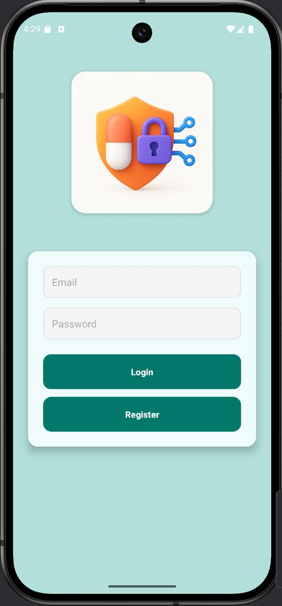
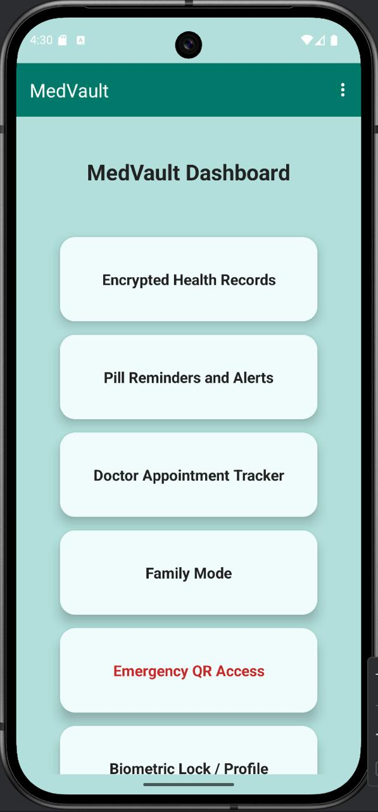
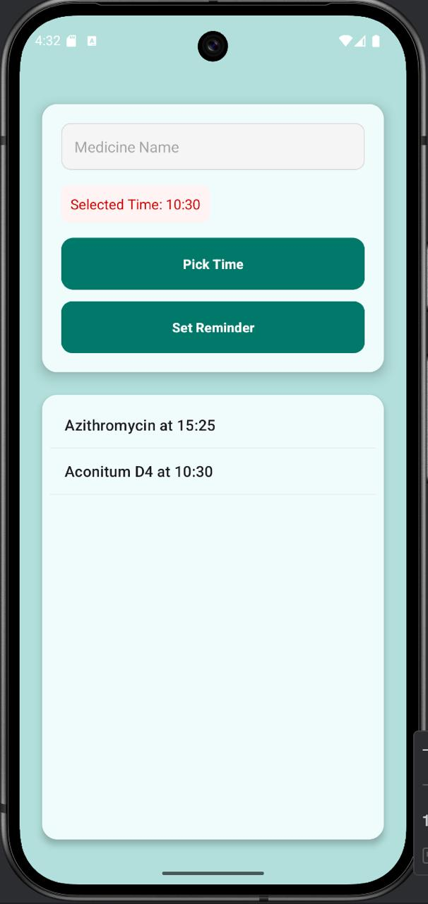
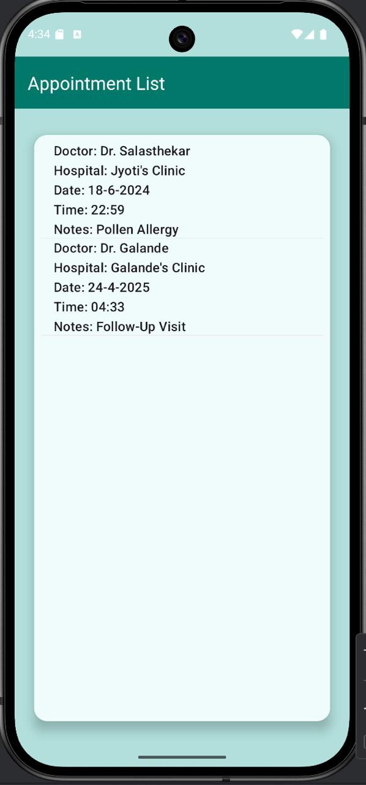
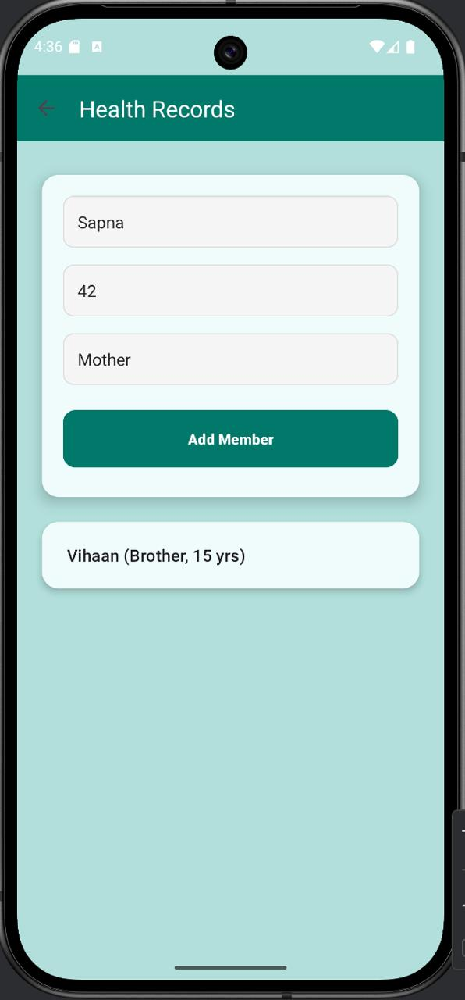
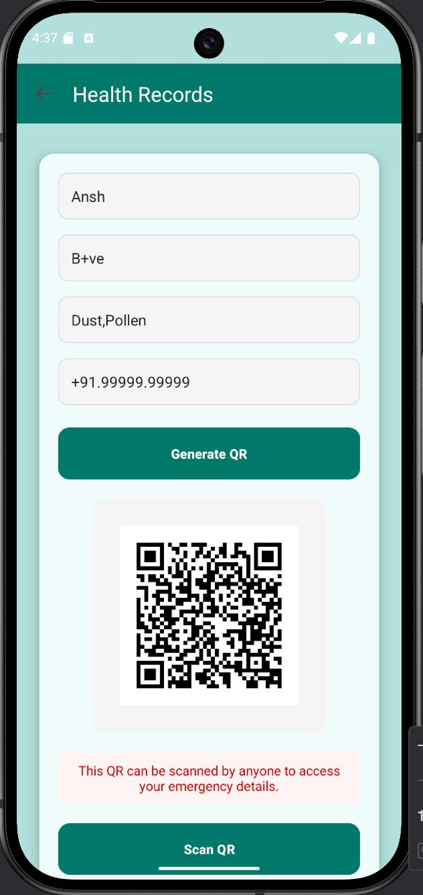
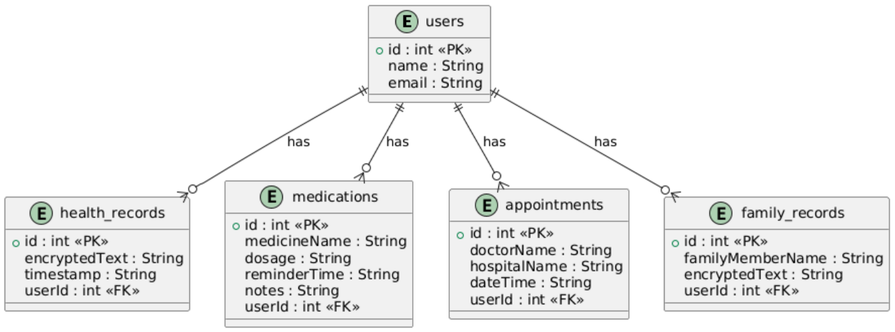

Submitted by:\
Ansh Goyal, Sri Anshu Kantipudi, Mihika Goyal, Shashwat Harsh

ICT Department\
Manipal Institute of Technology\
Manipal, India

**Table of Contents**

1.  Abstract

2.  Introduction

3.  Project Objective

4.  Tools and Technologies Used

5.  System Requirements

6.  Project Modules / Features

7.  Database Design

8.  Testing and Output

9.  Conclusion

10. References

**1. Abstract**

MedVault is a secure and smart health management Android application
designed to simplify and centralize medical recordkeeping. It addresses
common problems faced by patients, especially the elderly and
chronically ill, in tracking prescriptions, appointments, and health
documents. Key features include biometric authentication, medication
reminders, doctor appointment tracking, emergency QR-code access, and a
family mode for managing dependents. The app aims to ensure timely
medication, accessible health data, and privacy-focused storage.

**2. Introduction**

In today's digital era, individuals face challenges in managing
health-related documents and medication routines. Especially for people
with chronic conditions or elderly patients, staying on top of
appointments and medicine schedules can be overwhelming. MedVault was
conceptualized to address these pain points by providing a secure,
all-in-one platform for health record management. The app's relevance is
rooted in its ability to combine convenience with security, making
personal healthcare data readily available while ensuring it remains
confidential and tamper-proof.

**3. Project Objective**

-   To securely store medical prescriptions, test reports, and health
    documents.

-   To schedule smart medication reminders and refill alerts.

-   To track doctor appointments and receive timely notifications.

-   To manage medical data of multiple family members under one account.

-   To provide emergency QR code access for critical health information.

-   To ensure high-level security through biometric authentication.

**4. Tools and Technologies Used**

-   IDE: Android Studio

-   Frontend: XML

-   Backend: Java (Spring Boot)

-   Database: Room DB (SQLite wrapper)

-   Security: Android Keystore, AES Encryption (GCM/NoPadding), Base64
    encoding

-   QR Code: ZXing / Google ML Kit

-   Libraries: AndroidX, Room, BiometricPrompt, ZXing

**5. System Requirements**

-   **Minimum Android Version:** Android 7.0 (API Level 24)

-   **IDE Version:** Android Studio Giraffe \| 2022.3.1

-   **Android SDK version:** 34

-   **Hardware Requirements:**

Device RAM: Minimum 2GB

Storage: Minimum 100MB free

Camera access (for QR scanner and emergency QR)

Internet: For data sync (optional for extended features)

-   **Software Dependencies:**

ZXing library (QR code generation & scanning)

Room Persistence Library (local database)

AndroidX Components

NotificationManager, AlarmManager

**6. Project Modules / Features**

**a. Login/Register**

\- Allows users to securely log into the app or register as a new user.
Credentials stored securely.

\- Code snippet:\
If(username.equals(storedUsername) && password.equals(storesPassword))
{\
//Login success\
}

{width="1.6256692913385826in"
height="3.486456692913386in"}

**b. Home Screen**

\- Acts as a dashboard to navigate to all modules like Health Records,
Medication, Appointments, Family Mode, Emergency QR, and Profile.

\- Key Features: Tab-based layout and Clickable cards for navigation

{width="1.727273622047244in"
height="3.70252624671916in"}

**c. Encrypted Health Records**

\- Users can add, view, and delete personal medical records. All data is
encrypted using custom AES logic before saving to Room DB.

\- Code Snippet:\
String encrypted = EncryptionUtil.encrypt(\"Blood Pressure: 120/80\");

**d. Medication Reminder + Refill Alerts**

\- Allows users to set reminders for medication with dosage, time, and
frequency. Sends notifications using AlarmManager.

\- Code Snippet:\
AlarmManager am = (AlarmManager) getSystemService(ALARM_SERVICE);\
am.setExact(AlarmManager.RTC_WAKEUP, timeInMillis, pendingIntent);

{width="1.77540135608049in"
height="3.7504833770778654in"}

**e. Appointment Tracker**

\- Lets users save upcoming doctor appointments with doctor name,
hospital, and date/time.

\- Note: Uses Room DB to persist entries.

{width="1.7112303149606298in"
height="3.6620800524934385in"}

**f. Family Mode**

**-** Users can store and view encrypted health records of family
members.

{width="1.732620297462817in"
height="3.7207534995625546in"}

**g. Emergency QR Code**

**-** Generates a QR code containing name, blood group, allergies, and
emergency contact. Can be saved as a PDF.

\- Code Snippet:\
QRCodeWriter writer = new QRCodeWriter();\
BitMatrix matrix = writer.encode(data, BarcodeFormat.QR_CODE, 500, 500);

{width="1.7770713035870516in"
height="3.7540102799650046in"}

**h. Profile Management**

\- Displays user info. Future scope includes profile picture, password
change, or sync to cloud.

**7. Database Design**

**Tables & Fields**

a.  **health_records\
    **id (int, Primary Key)\
    encryptedText (String)\
    timestamp (String)

b.  **medications\
    **id (int, Primary Key)\
    medicineName (String)\
    dosage (String)\
    reminderTime (String)\
    notes (String)

c.  **appointments\
    **id (int, Primary Key)\
    doctorName (String)\
    hospitalName (String)\
    dateTime (String)

d.  **family_records\
    **id (int, Primary Key)\
    familyMemberName (String)\
    encryptedText (String)

**ER Diagram**

{width="6.4009547244094485in"
height="2.379613954505687in"}

**Sample Data**

a.  **medications**

  ------------------------------------------------------------------------------
  **id**       **medicineName**   **dosage**    **reminderTime**   **Notes**
  ------------ ------------------ ------------- ------------------ -------------
  **1**        **Paracetamol**    **500mg**     **9:00 AM**        **After
                                                                   food**

  ------------------------------------------------------------------------------

b.  **appointments**

  ------------------------------------------------------------------------
  **id**   **doctorName**    **hospitalName**    **dateTime**
  -------- ----------------- ------------------- -------------------------
  **1**    **Dr. Smith**     **Apollo Hospital** **25-Apr-2025 10:00 AM**

  ------------------------------------------------------------------------

**8. Testing and Output**

a\. Testing Process:\
- Manual testing on Android devices and emulators\
- Functional testing for reminders, QR access, biometric login\
- Edge case testing for invalid inputs and network failures\
b. Sample Outputs:\
- Screenshots showing home screen, reminders, QR code scanner, etc.\
- Log outputs of scheduled notifications and successful data encryption\
c. Known Issues:\
- QR code might not open correctly on certain low-end phones\
- Delays in biometric prompt on some devices

**9. Conclusion**

MedVault provides a reliable and secure platform for managing personal
and family healthcare information. It streamlined the process of
tracking medications, storing medical documents, and preparing for
emergencies. Throughout the development process, we learned how to
integrate secure storage systems, handle user authentication, and build
a robust Android interface. Challenges included managing encrypted data
across components and ensuring UI responsiveness.

**10. Future Scope:**

\- Cloud backup integration\
- AI-driven health analytics\
- Direct hospital data linking\
- Voice command integration for visually impaired users

**11. References**

\- Android Developer Documentation: https://developer.android.com\
-YouTube: Android Development by Coding in Flow\
- StackOverflow: For Room DB queries and biometric issues\
- ZXing GitHub Repo: https://github.com/zxing/zxing\
- Firebase Authentication Docs
